-9### Crypto Market Analysis
2023-06-06 10:42

---

SEC sued Binance and CZ, cryptocurrency market decline sharply. It could be an opportunity 
to buy low.

ARB `most recommended`

ETH, BNB `secondary and risky`

---
> BTC

The px reversed to exceed the MA10-10 px in 1H, but still lower than the MA10-10 px in 4H.
It could be a long opportunity if the px hit 26507.20. 
The next key px should be the 1D MA10-10 close px, 26821.28.
Note, it might be the start point of a downtrend in such a bear market, not reach its end. 

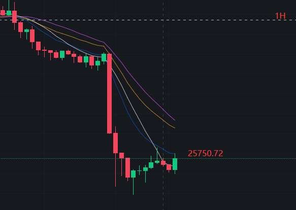

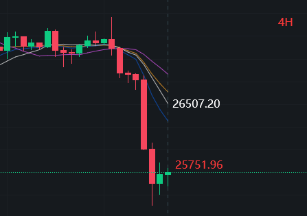

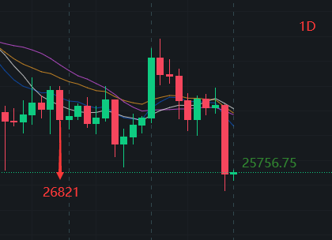

> ETH 

The trend in 1H and 4H are almost the same as BTC, but it's difference in 1D.
The px was greater than MA20-20 px and lower than MA10-10 px, the trends reverse probably
if the px keep raising and close to 1854, a close px between MA20-20 and MA10-10.
This can make a bet to buy now. 

> BNB
 
Because the SEC sued Binance and CZ, BNB px declined sharply, fallen down 9%, from 305 to 276. 
The trend in 1H and 4H also looks like BTC, the different point is that this fell down is a breaking event,
it needs more news and details to figure out what actually happened and how things are going, but the px reversed and hit the MA10 px in 1H,
and raising up to close to MA10 px in 4H, it shows that this could be the opportunity to buy BNB low.

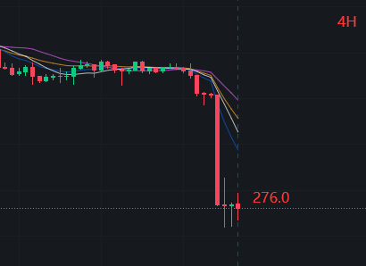

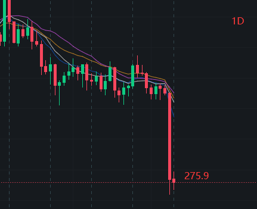

> ARB

ARB looks very steady under the SEC regulatory panic, compared to other coins. 
The px has not fluctuated very much in both 1H, 4H and 1D.
The px exceeded MA10 in 1H and the reversing flow in 4H is more powerful than down flow.
The moving averages are very dense and the px almost trends to consistent in 1D, the down flow looks weak here.
The MA10-10 px is 1.2481, MA20-20 px is 1.1558, can buy at 1.2481 due to such a stable performance. 
There is a good entrance now or waiting till the px hit 1.1558 if the SEC event not going worst.

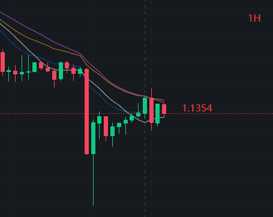

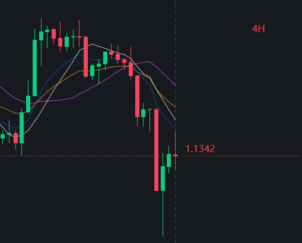

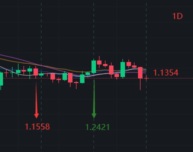

> CFX

The trend also like BTC, raising up slowly, but the flow seems weak, better be waiting.
It feels like a low px 0.22 compared to its history 0.30+, but still a little way off its MA10 px in 4H.
The MA10 px 0.2449 could be an entrance for short-time trading.
For long-time trading in 1D, a recent crucial px could be the previous lowest-px 0.2717 or 
more decided MA20-20 px 0.2937.

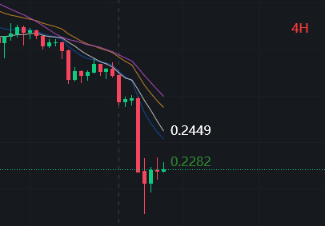

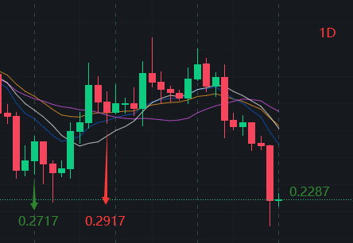

> MAGIC

The trend same as BTC, the MA10 px 0.9406 should be the trend reversing point,
but is in the raising trend in 1D and the px gap between the MA10 and MA20 was reducing.
Let's see the px will hit MA20-20 px 0.9045 or not, and better be waiting the end of the raising trend.

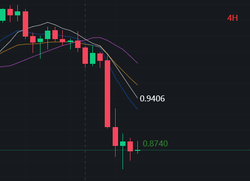

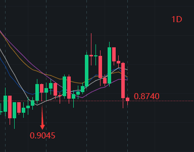
