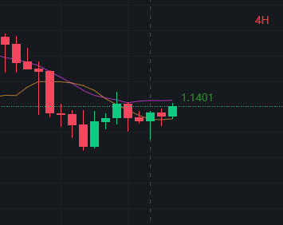

### Crypto Market Analysis
2023-06-09 16:06

---

Fluctuating ...

ARB `recommended`

BNB `risky but great profit`

---
> BTC

Based on 1D, the market in downtrend so it's not a good px to join.
We can watch two px like MA10-10 27210.35 and MA20-20 26747.78, 
and the higher px 27210.35 could be more crucial due to such a bear market
and weak raising flow.

> ETH 

The downtrend in 1D and feels like it'll be over soon, but it's still not easy to reverse the trend. 
The px have to be raised up to the MA10-10 px 1906 that possibly make MA10 and MA20 turns to uptrend.
Long ETH will be more risk than previous market at 6 June that the px exceeded the expected px 1854 but soon fell.
The loss px should still be recent history lowest px 1794.30 if buy long at 1854 in 6 June and be patient, 
there is a chance to turn a loss around in several days.

> BNB
 
SEC sued event still in a mist, Binance choose not to compromise but argue with SEC, keep watching the result. 
Because of that, BNB experienced the second sharply downtrend, and the px fell down to 259.
Choose to believe that the BNB will recover soon due to the history market trending under breaking event related to Binance,
and the RSI oversell and less than 30 and the recovering flow is trying to raise up the px to exceed the MA10 line in such a drastic downtrend,
continued dropped down two low point. Those case showing that it's more likely the trend will be reversed.

> ARB

ARB market goes not so well as expected before at 6 June. It's in uptrend in 1H and raising up from the low point in 4H, like a reverse trend.
The trend is not so clear in 1D in such a MA10 and MA20 downtrend joint point, better be waiting the px hit 1.2481 so that the MA10 and MA20 lines becomes the uptrend-like.
It's ok to buy long based on its product and community, but keep eyes on the recent lowest point 1.0945, the loss px.

> CFX

To be determined

> MAGIC

To be determined
